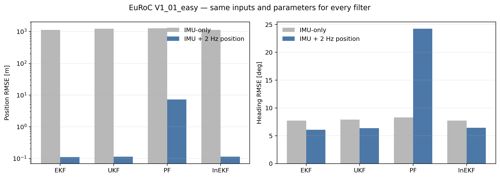
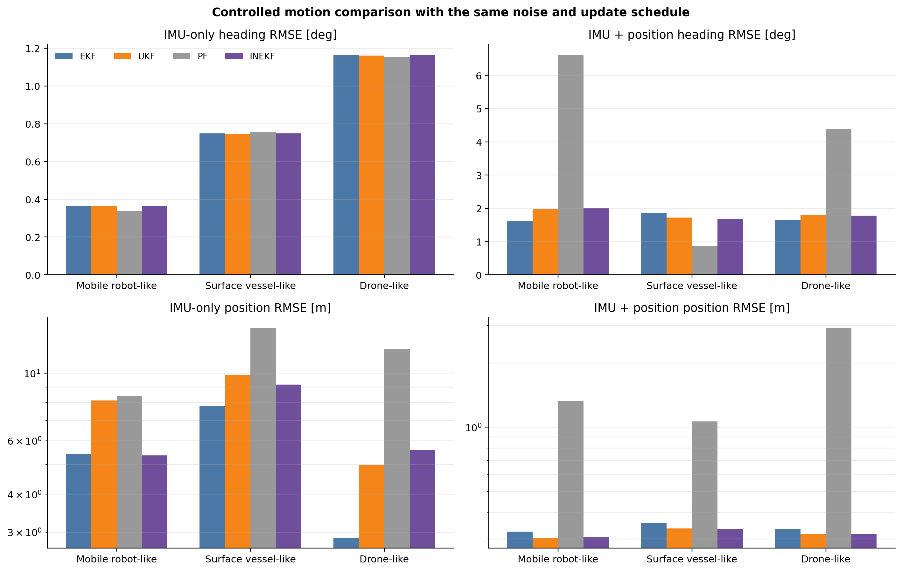
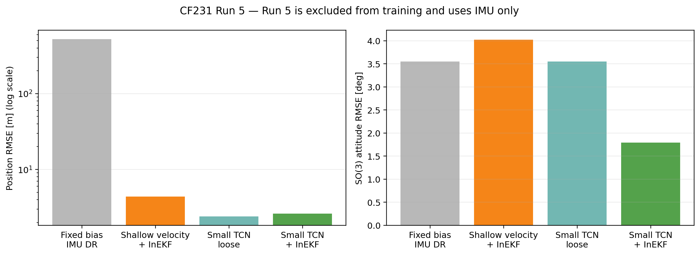
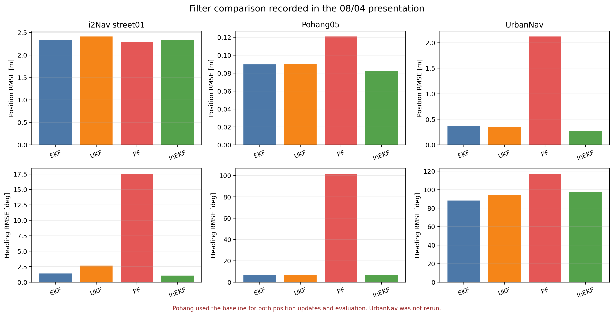

# 실험 결과

이 문서에서는 이번 저장소의 코드로 다시 실행한 결과와, 이전 발표자료에만 남아 있는 결과를 나눠서 정리했습니다. 같은 조건으로 다시 돌린 값은 아닌 경우 표 아래에 따로 표시했습니다.

## 1. EuRoC V1_01_easy

| 입력 조건 | 필터 | 위치 RMSE [m] | Roll/Pitch/Heading RMSE [deg] | 실행시간 [s] |
|---|---:|---:|---:|---:|
| IMU-only | EKF | 1,129.277 | 8.405 / 2.657 / 7.721 | 13.20 |
| IMU-only | InEKF | 1,130.116 | 8.405 / 2.657 / 7.721 | **4.85** |
| IMU + 2 Hz position | EKF | **0.1098** | **3.044** / 0.790 / **6.094** | 15.90 |
| IMU + 2 Hz position | InEKF | 0.1140 | 4.367 / **0.783** / 6.426 | **8.51** |

위 결과는 `runners/run_all.py`로 V1_01_easy 전체 구간을 다시 실행해 얻은 값입니다. IMU만 사용했을 때는 EKF와 InEKF 모두 위치가 크게 발산했습니다. 측정 update가 없으면 두 필터가 같은 IMU 운동 모델을 적분하기 때문에 nominal trajectory가 거의 같게 나옵니다.

2 Hz 위치 update를 넣으면 위치 오차는 0.11 m 정도로 줄었습니다. 현재 설정에서는 EKF의 위치와 heading RMSE가 조금 낮았고, InEKF는 실행시간이 짧었습니다. 이때 사용한 위치 측정은 실제 GPS가 아니라 GT 위치에 0.05 m 표준편차의 noise를 넣은 값입니다.

## 2. 회전량을 다르게 둔 합성 실험

실험 길이, IMU noise, bias, 1 Hz 위치 update는 같게 두고 roll, pitch, yaw 운동만 다르게 설정했습니다. InEKF의 IMU-only heading RMSE는 mobile robot-like 0.366°, surface vessel-like 0.748°, drone-like 1.162°였습니다. 회전량이 커질수록 IMU-only heading 오차는 커졌지만, position update를 넣은 경우에 InEKF가 EKF보다 계속 좋아지는 경향은 보이지 않았습니다.

따라서 현재 결과만으로는 “회전이 많으면 InEKF가 더 정확하다”고 말하기 어렵습니다. 다음 실험에서는 각속도가 큰 구간만 따로 나눠 heading과 SO(3) 오차, NIS/NEES를 확인할 필요가 있습니다.

## 3. CF231 Run 5

| 방법 | 위치 RMSE [m] | 최종 위치오차 [m] | SO(3) RMSE [deg] | 최종 SO(3) 오차 [deg] |
|---|---:|---:|---:|---:|
| Fixed-bias IMU DR | 522.2007 | 1,005.4296 | 3.5535 | 8.7520 |
| Small TCN | **2.3955** | **2.8399** | 3.5535 | 8.7520 |
| Small TCN + InEKF | 2.6131 | 3.2410 | **1.7964** | **0.4605** |

Runs 3, 4, 9, 10으로 Small TCN을 학습하고 Run 5는 학습에 넣지 않았습니다. Run 5 추론에서는 시작 상태와 시작 정지구간에서 계산한 고정 bias, 그리고 이후의 IMU만 사용했습니다.

Small TCN으로 예측한 속도를 바로 적분한 경우가 위치 RMSE는 가장 낮았습니다. 같은 속도를 InEKF measurement로 넣은 경우 위치 RMSE는 9.1% 커졌지만, SO(3) 자세 RMSE는 3.55°에서 1.80°로 줄었습니다. 이 실험에서 InEKF의 장점은 위치 RMSE보다 자세 보정에서 나타났습니다.

## 4. 실험 결과

Pohang 위치 결과는 `baseline.txt`를 필터 update와 오차 계산에 같이 사용했기 때문에 실제 위치 성능보다 좋게 나올 수 있습니다. UrbanNav는 당시 사용한 loader와 설정이 현재 저장소에 남아 있지 않습니다. 그래서 이 표는 현재 코드의 최종 성능 비교에는 사용하지 않았습니다.

## 5. 수치 파일

- `reports/data/euroc_results.csv`: 다시 실행한 EuRoC 결과
- `reports/data/motion_regime_metrics.csv`: 회전량 합성 실험
- `reports/data/cf231_run5_summary.json`: CF231 학습부터 평가까지 전체 결과
- `reports/data/cf231_learned.csv`: CF231 방법별 비교표
- `reports/data/historical_full_sequence.csv`: 8월 4일 발표자료 수치
- `reports/data/reference_comparison.csv`: 자체 InEKF와 외부 구현 비교 수치

실험 설정은 [EXPERIMENTS.md](EXPERIMENTS.md), 전체 연구 과정은 [보고서](reports/KRISO_STATE_ESTIMATION_REPORT.md)에 적어 두었습니다.
