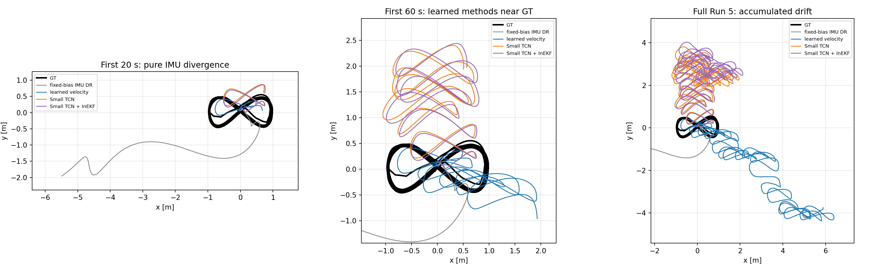

# IMU 기반 상태추정과 Invariant EKF의 데이터셋별 검증

## 고정 bias 관성항법, GNSS/위치 결합 및 경량 학습 속도 보정

---

## 초록

이번 연구에서는 같은 15차원 관성항법 상태를 사용하는 EKF, UKF, PF, ESKF, Invariant EKF(InEKF)를 하나의 실행 구조로 묶고, IMU-only dead reckoning과 위치 측정을 추가한 상태추정을 비교했다. 확인하려는 내용은 네 가지다. 첫째, IMU bias를 한 번 정해 고정했을 때 순수 관성항법의 오차가 얼마나 증가하는지 측정한다. 둘째, GPS 또는 위치 측정을 넣었을 때 필터별 위치, 자세, heading 오차를 비교한다. 셋째, 이동로봇·수상선·드론처럼 회전 운동이 달라지는 조건에서 InEKF의 상대적인 이점이 나타나는지 확인한다. 넷째, 이전 주행 데이터로 학습한 IMU-to-velocity 모델을 InEKF의 측정으로 사용해 평가 중에는 IMU만으로 상태를 추정하는 방법을 시험한다.

EuRoC V1_01_easy에서 IMU-only 위치 RMSE는 EKF 1,129.28 m, InEKF 1,130.12 m로 모두 크게 증가했다. 2 Hz 위치 측정을 넣으면 각각 0.110 m와 0.114 m로 줄었다. 이 조건에서 InEKF의 정확도는 EKF보다 높지 않았지만, 실행시간은 8.51 s로 EKF의 15.90 s보다 짧았다. 센서 오차와 update 조건은 같게 두고 회전 크기만 바꾼 합성 실험에서도 회전이 커질수록 InEKF가 계속 좋아지는 결과는 나오지 않았다. 따라서 현재 구현과 parameter만으로는 “3차원 회전이 많으면 InEKF가 자동으로 더 정확하다”고 말하기 어렵다.

CF231 Run 5를 학습에서 제외하고 Runs 3/4/9/10으로 Small TCN을 학습했다. 평가할 때는 Run 5 IMU만 입력해 속도를 예측했다. 고정 bias IMU dead reckoning의 위치 RMSE는 522.20 m였고, 예측 속도를 직접 적분하면 2.40 m, InEKF에 결합하면 2.61 m였다. InEKF를 결합했을 때 위치 RMSE는 직접 적분보다 9.1% 높았지만, SO(3) 자세 RMSE는 3.55°에서 1.80°로 49.5% 줄었다. 평가 궤적의 위치나 GT를 입력으로 넣은 것은 아니며, 이전 데이터에서 학습한 IMU 구간과 속도의 관계를 새 IMU에 적용했다. 다만 한 플랫폼의 Run 5 하나만 평가했기 때문에 다른 플랫폼에서도 같은 성능이 나오는지는 아직 확인하지 못했다.

**주요어:** inertial navigation, dead reckoning, InEKF, GNSS/INS, heading, temporal convolutional network

---

## 1. 연구 배경과 목표

가속도계 출력은 자세를 이용해 세계 좌표계로 회전한 후 중력을 제거하고 두 번 적분해야 위치가 된다. 따라서 작은 가속도 bias는 위치 오차를 시간의 제곱에 비례해 증가시키고, 작은 자세 오차는 중력의 일부를 수평 가속도로 잘못 투영한다. 자이로 bias로 인한 yaw 오차 또한 진행 방향을 지속해서 회전시킨다. 외부 관측 없이 일반적인 6자유도 운동을 하는 시스템에서 위치·속도·yaw 및 bias를 장시간 절대적으로 관측하는 것은 불가능하므로, 순수 IMU 적분의 장기 궤적 발산은 구현 오류만의 문제가 아니라 관측 가능성의 한계이기도 하다.

교수님 피드백을 바탕으로 다음 질문을 나누어 확인했다.

1. bias는 시간마다 GT에 맞춰 바꾸지 않고, 실험 시작 구간 또는 학습 run에서 한 번 추정한 값을 고정했는가?
2. IMU-only일 때 필터별 자세와 heading 오차는 어느 정도이며 위치는 어떤 속도로 발산하는가?
3. 같은 IMU에 GPS/위치 측정을 추가했을 때 EKF, UKF, PF, ESKF, InEKF의 성능은 어떻게 달라지는가?
4. 평면 이동로봇에서 수상선과 드론으로 회전 운동이 커질수록 InEKF의 상대 성능이 증가하는가?
5. 시험 시 다른 센서를 사용하지 않으면서 과거 데이터의 학습으로 IMU-only 추정을 개선할 수 있는가?

GT는 오차 계산과 학습 데이터의 정답에만 사용했다. 평가 run에서 상태를 추정할 때는 GT를 입력하지 않았다. 위치나 GPS를 추가한 실험은 IMU-only 결과와 따로 표시했다.

### 1.1 방학 중 연구 진행 흐름

| 시기 | 수행 내용 | 남은 산출물 또는 판단 |
|---|---|---|
| 6월 22일 이후 | 2D/3D 상태, quaternion·rotation matrix·Lie-group 표현과 EKF/UKF/PF/ESKF/InEKF 구조 비교 | 공통 15D error-state 규약 확정 |
| 7월 | 고정 bias 추정, IMU-only dead reckoning, RPY/heading 및 궤적 시각화, EuRoC·KAIST·CF231 검증 | 시간에 따라 GT로 bias를 바꾸는 방식 배제 |
| 8월 4일 전후 | 팀원 공통 filter library, 외부 InEKF 구현 비교, i2Nav·Pohang·UrbanNav 장시간 결과 취합 | 일부 결과의 measurement/reference 독립성 문제 확인 |
| 8월 | shallow learned velocity, Small TCN, InEKF velocity update의 held-out Run 5 비교 | 위치와 자세 성능의 trade-off 정리 |
| 9월 | 설치형 Python API, 명령행 실행기, test, 사용 문서, 결과 CSV와 보고서 정리 | 실제 세 플랫폼의 동일 GNSS 조건 비교는 후속 실험 |

표에는 연구의 큰 흐름만 적었다. 중간에 시도한 모든 실험을 저장소에 넣지는 않았고, 결과를 설명하는 데 필요한 비교 방법과 Small TCN, 실패 원인을 확인할 수 있는 정보만 남겼다.

## 2. 통합 코드와 상태 정의

### 2.1 팀원 State Estimation 저장소의 통합

팀원 저장소([andyjaehun/State_Estimation](https://github.com/andyjaehun/State_Estimation))에서 필터마다 달랐던 입력, 상태, 평가 코드를 공통 인터페이스로 정리했다. 이번 저장소에는 그 구조를 바탕으로 실행 설정, 회전 운동 합성 실험, 결과 CSV, 그림 생성 코드와 보고서를 추가했다.

공통 IMU 입력은 다음 순서다.

`u_k = [a_x, a_y, a_z, omega_x, omega_y, omega_z]^T`

공통 nominal state는 위치, 속도, 자세, 자이로 bias 및 가속도계 bias로 구성된다.

`X = {R, v, p, b_g, b_a}`  
`delta_x = [delta_theta, delta_v, delta_p, delta_b_g, delta_b_a] in R^15`

Quaternion EKF는 nominal quaternion 네 성분 때문에 내부 nominal state가 16차원이지만, UKF·ESKF·InEKF는 자세 불확실성을 3차원 tangent error로 표현한다. InEKF는 `R, v, p`를 `SE_2(3)` 형태의 행렬 상태에 넣고 invariant error로 공분산을 전파한다. Barrau와 Bonnabel의 이론이 보장하는 핵심은 적절한 group-affine 시스템에서 오차 동역학이 추정 궤적에 덜 의존한다는 점이지, 모든 데이터와 모든 튜닝에서 EKF보다 작은 RMSE가 자동으로 보장된다는 뜻은 아니다.

### 2.2 비교 필터

| 필터 | 자세 및 오차 표현 | 코드에서의 역할 | 현재 판단 |
|---|---|---|---|
| EKF | additive quaternion nominal | 일반적인 비선형 Kalman 기준선 | EuRoC fused에서 가장 낮은 위치·heading RMSE |
| UKF | quaternion nominal + 15D local error | sigma-point 비선형 전파 | 정확도는 InEKF와 유사하나 실행시간이 큼 |
| PF | quaternion particle | 비가우시안 기준선 | 500 particles 설정에서 정확도와 안정성이 부족 |
| ESKF | rotation matrix + 15D error | 오차상태 기준선 | 현재 EuRoC 결과가 발산하여 구현 검증 전까지 제외 |
| InEKF | `SE_2(3)` + 15D invariant error | 주요 연구 대상 | 업데이트가 있을 때 구조적 이점을 기대; prediction-only nominal 궤적은 EKF와 거의 동일 |

ESKF는 EuRoC fused 실험에서 위치 RMSE 86.0 m, heading RMSE 102.5°로 비정상적인 결과가 나타났다. 이는 ESKF 이론의 성능으로 해석하지 않고 현재 코드의 error injection 부호, 좌표계 또는 Jacobian을 검증해야 할 구현 문제로 보았다.

## 3. 실험 설계

### 3.1 결과를 정리한 기준

현재 저장소의 코드로 다시 실행한 결과에는 설정 파일과 CSV 또는 JSON이 함께 있다. i2Nav, Pohang, UrbanNav와 외부 InEKF 비교 수치는 당시 진행 내용을 확인하기 위한 자료이며 현재 코드의 최종 성능으로 사용하지 않았다. 데이터나 설정이 부족해 다시 실행하지 못한 조건도 결과 비교에서 제외했다.

### 3.2 데이터셋과 측정 조건

| 데이터/조건 | 플랫폼·운동 | IMU-only | 외부 update | 사용 목적 | 결과 출처 |
|---|---|---:|---|---|---|
| EuRoC V1_01_easy | MAV, 3D 운동 | O | GT 위치로 만든 2 Hz 측정 | 같은 입력에서 필터 비교 | 현재 코드로 실행 |
| 회전 운동 합성 데이터 | 이동로봇/선박/드론 형태 | O | 1 Hz 위치 | 회전량만 바꾼 비교 | 현재 코드로 실행 |
| CF231 Run 5 | 반복 8자 비행 | O | 학습 속도 | 고정 bias와 학습 방법 비교 | 현재 코드로 실행 |
| i2Nav street01 | 이동로봇 | 별도 기록 없음 | F9P GNSS | 장시간 필터 비교 | 8월 4일 실험 결과 |
| Pohang05 | 무인수상선 | 별도 기록 없음 | baseline 위치 | 해양 데이터 비교 | 8월 4일 실험 결과, 같은 위치를 평가에도 사용 |
| UrbanNav | 지상차량 | 별도 기록 없음 | GNSS/위치 | 도심 GNSS 조건 | 8월 4일 실험 결과, loader 없음 |

EuRoC의 fused 조건은 실제 GPS가 아니라 GT 위치에 0.05 m 표준편차를 가정해 2 Hz로 넣은 pseudo-measurement다. 따라서 “GPS 성능”이 아니라 필터의 position-update 동작을 검증하는 통제 조건으로 해석해야 한다.

Pohang loader는 `baseline.txt`를 reference trajectory와 position measurement 양쪽에 사용한다. 따라서 위치 RMSE는 독립적인 localization 성능이 아니며 낙관적으로 작아질 수 있다. 향후에는 RTK-GPS를 update로 사용하고 SLAM baseline 또는 별도 정밀 항법을 reference로 사용해야 한다.

### 3.3 공통 평가지표

위치 RMSE와 roll/pitch/yaw RMSE를 사용하였다. 자세 전체 오차는 회전행렬 간 geodesic angle로 계산한 SO(3) RMSE를 함께 사용했다. 궤적은 초기 위치와 초기 yaw를 한 번 정렬하고, 평가 중 반복 정렬하거나 GT로 scale을 보정하지 않는다. 향후 장거리 결과에는 ATE뿐 아니라 고정 시간·거리 구간의 relative pose error도 추가해야 한다.

## 4. 고전 필터 결과

### 4.1 EuRoC: IMU-only와 위치 결합


| 모드 | 필터 | 위치 RMSE [m] | 최종 위치오차 [m] | Roll [°] | Pitch [°] | Heading [°] | 시간 [s] |
|---|---:|---:|---:|---:|---:|---:|---:|
| IMU-only | EKF | 1,129.28 | 2,880.71 | 8.41 | 2.66 | 7.72 | 13.20 |
| IMU-only | UKF | 1,225.22 | 3,202.69 | 8.53 | 2.71 | 7.89 | 31.38 |
| IMU-only | PF-500 | 1,263.08 | 3,253.15 | 8.62 | 2.71 | 8.31 | 8.95 |
| IMU-only | InEKF | 1,130.12 | 2,882.19 | 8.41 | 2.66 | 7.72 | 4.85 |
| IMU + position | EKF | **0.110** | 0.047 | **3.04** | 0.79 | **6.09** | 15.90 |
| IMU + position | UKF | 0.114 | 0.042 | 4.31 | 0.78 | 6.37 | 30.77 |
| IMU + position | PF-500 | 7.186 | 4.088 | 8.46 | 2.53 | 24.25 | 8.60 |
| IMU + position | InEKF | 0.114 | **0.042** | 4.37 | **0.78** | 6.43 | **8.51** |

IMU-only에서 EKF와 InEKF의 위치 및 자세가 사실상 같은 이유는 두 필터 모두 동일한 strapdown nominal dynamics를 적분하기 때문이다. 측정 업데이트가 없으면 서로 다른 error definition과 covariance가 nominal state를 교정할 기회가 없다. 즉 InEKF를 사용하는 것만으로 IMU의 비관측 drift가 제거되지 않는다.

위치 업데이트는 모든 Kalman 계열 위치 발산을 크게 제한했다. 그러나 이 쉬운 EuRoC 시퀀스와 현재 파라미터에서는 EKF가 InEKF보다 위치 RMSE와 heading RMSE가 각각 3.7%, 5.2% 낮았다. 반대로 InEKF 실행시간은 EKF보다 약 46.5% 짧았다. 따라서 이 결과의 정직한 결론은 “InEKF가 정확도에서 우월하다”가 아니라 “공통 인터페이스에서 정상적으로 수렴하고 UKF와 유사한 정확도를 더 짧은 시간에 냈지만, EKF 대비 정확도 이점은 확인되지 않았다”이다.

### 4.2 8월 4일 실험 결과


| 데이터 | 지표 | EKF | UKF | PF | InEKF | 당시 최선 |
|---|---|---:|---:|---:|---:|---|
| i2Nav street01 | Position RMSE [m] | 2.336 | 2.411 | **2.290** | 2.333 | PF |
|  | Heading RMSE [°] | 1.388 | 2.698 | 17.552 | **1.058** | InEKF |
| Pohang05 | Position RMSE [m] | 0.0898 | 0.0902 | 0.1210 | **0.0821** | InEKF* |
|  | Heading RMSE [°] | 6.703 | 6.821 | 101.721 | **6.442** | InEKF |
| UrbanNav | Position RMSE [m] | 0.3725 | 0.3534 | 2.1210 | **0.2766** | InEKF |
|  | Heading RMSE [°] | **88.212** | 94.419 | 117.165 | 96.975 | EKF |

\* Pohang 위치 점수는 baseline/reference leakage가 있어 독립 성능으로 주장할 수 없다.

당시 표에서는 InEKF의 heading 오차가 i2Nav와 Pohang에서 가장 작았고, 위치 오차는 Pohang과 UrbanNav에서 가장 작았다. 반면 UrbanNav heading은 EKF보다 컸고, i2Nav 위치는 PF가 조금 작았다. i2Nav는 이동로봇, Pohang은 수상선, UrbanNav는 지상차량이므로 이 세 결과만으로 “이동로봇 → 수상선 → 드론” 순서의 운동 복잡도를 비교할 수는 없다. 실제 드론 데이터에도 같은 GPS update 주기, noise, 평가 시간을 적용한 결과가 더 필요하다.

### 4.3 외부 InEKF 구현과의 수치 비교

[ghaggin/invariant-ekf](https://github.com/ghaggin/invariant-ekf)와 자체 InEKF를 EuRoC, KAIST, UZH, ADVIO, Crazy4에서 비교했다. EuRoC, KAIST, UZH, Crazy4의 위치와 heading 수치가 거의 같아 기본 predict와 update 계산이 reference 코드와 비슷하게 동작하는 것을 확인했다. ADVIO의 heading RMSE는 자체 코드 122.0°, reference 코드 102.2°로 둘 다 매우 컸다. 이 결과는 성공 사례가 아니라 좌표계 정의나 초기 yaw 문제를 확인해야 하는 사례로 보았다. 수치는 `reports/data/reference_comparison.csv`에 적어 두었다.

## 5. 회전 운동 증가 가설의 통제 검증


실제 데이터셋 간 센서 품질, 길이, GNSS 주기, 좌표계 및 파라미터가 모두 다르면 플랫폼 차이와 필터 차이를 분리할 수 없다. 이를 보완하기 위해 45 s, 50 Hz IMU, 동일 bias·noise, 동일 1 Hz 위치 업데이트를 사용하고 회전율과 roll/pitch/z 진폭만 증가시키는 합성 실험을 수행했다.

| 조건 | 각속도 RMS [rad/s] | Roll/Pitch 진폭 [°] | InEKF IMU-only heading [°] | InEKF fused heading [°] | InEKF fused position [m] |
|---|---:|---:|---:|---:|---:|
| mobile-like | 0.312 | 1 / 1 | 0.366 | 2.008 | 0.305 |
| vessel-like | 0.586 | 5 / 4 | 0.748 | 1.686 | 0.334 |
| drone-like | 1.019 | 15 / 10 | 1.162 | 1.781 | 0.316 |

회전이 증가하면 IMU-only heading 오차는 커졌지만, InEKF의 EKF 대비 정확도 우위는 단조롭게 증가하지 않았다. fused heading에서는 mobile-like와 drone-like에서 EKF가 더 낮고, vessel-like에서는 InEKF가 EKF보다 약 9.8% 낮았다. 위치에서는 InEKF가 UKF와 거의 같고 EKF보다 5~6% 낮았다. 이는 InEKF의 장점이 단순 회전 크기 자체가 아니라 measurement model의 invariant 구조, 자세-속도-위치 cross-correlation, 초기 오차, update 간격 및 consistency에 의해 드러남을 뜻한다.

그러므로 진도회의에는 해당 가설을 “확인 완료”로 제시하기보다 다음 단계의 검증 가설로 제시해야 한다. 공정한 실제 데이터 비교를 위해 각 플랫폼에서 동일한 GNSS rate/noise를 재생성하고, 고회전 구간 마스크에서 heading RMSE와 NEES/NIS를 따로 계산해야 한다.

## 6. IMU 기반 학습 속도 보정

### 6.1 학습 데이터와 평가 데이터 분리

CF231 반복 비행 데이터에서 Run 5는 학습에 넣지 않았다. Runs 3/4/9/10은 Small TCN 학습에, Runs 3/9/10은 IMU noise와 gyro intrinsic 계산에 사용했다. 입력은 약 2초에 해당하는 200개의 6축 IMU이며 출력은 heading 좌표계의 속도다. 네트워크는 36,003 parameters의 입력층과 세 개 residual temporal block으로 구성했다. Run 5에서는 초기 상태와 처음에 한 번 정한 bias, 이후의 Run 5 IMU만 사용했다. PWM, thrust, GNSS, camera, 운동 범위 제약과 GT 위치로 만든 측정은 사용하지 않았다.

Run 5에서 고정한 bias는 다음과 같다.

`b_g = [-3.308e-4, -9.214e-5, 3.601e-5] rad/s`  
`b_a = [0.41543, 0.14960, 0.00771] m/s^2`

이 값은 Run 5 시작 후 약 2.63초 동안의 정지 구간 IMU 평균으로 한 번 계산하고 전체 구간에 고정했다. 학습 run의 계산값과 설정은 `reports/data/cf231_run5_summary.json`에 적어 두었다.

### 6.2 모델과 결합 방법

Small TCN은 convolution의 receptive field로 짧은 진동·회전 패턴과 속도의 관계를 학습한다. 이는 현재 위치에서 유한차분한 “가상 속도”를 필터에 다시 넣는 것과 다르다. 평가 run의 위치를 사용하지 않고 과거 run의 GT velocity를 training label로만 사용한다.

- **Small TCN loose:** 예측한 속도를 직접 적분한다. InEKF의 고정-bias attitude를 사용하지만 속도 residual을 Kalman update로 넣지 않는다.
- **Small TCN + InEKF:** 동일한 예측 속도와 cross-validation residual covariance를 `z_v = v + n_v` 형태의 virtual measurement로 넣는다. InEKF가 innovation, gain 및 cross-covariance를 이용해 속도뿐 아니라 자세·위치 오차를 함께 교정한다.

TLIO도 IMU window에서 3차원 변위와 uncertainty를 예측해 EKF에 결합한다는 점에서 방향은 비슷하다. 여기서는 더 작은 TCN이 heading 좌표계의 속도를 예측하도록 만들었다. 입력과 출력, 모델 크기가 다르므로 TLIO와 같은 알고리즘이나 같은 성능으로 보지는 않았다.

### 6.3 결과




| 방법 | 위치 RMSE [m] | 최종 위치오차 [m] | SO(3) RMSE [°] | 최종 SO(3) [°] | Roll/Pitch/Yaw RMSE [°] |
|---|---:|---:|---:|---:|---:|
| Fixed-bias IMU DR | 522.20 | 1,005.43 | 3.55 | 8.75 | 1.41 / 3.15 / **0.83** |
| Shallow velocity + InEKF | 4.39 | 7.75 | 4.03 | 5.07 | 1.16 / 0.87 / 3.76 |
| Small TCN loose | **2.40** | **2.84** | 3.55 | 8.75 | 1.41 / 3.15 / **0.83** |
| Small TCN + InEKF | 2.613 | 3.241 | **1.796** | **0.461** | **1.10 / 0.84** / 1.14 |

Small TCN loose는 fixed-bias IMU DR 대비 위치 RMSE를 99.54% 줄였고, shallow learned velocity보다 45.5% 낮았다. Small TCN+InEKF는 fixed-bias 대비 위치 RMSE를 99.50% 줄였으며 SO(3) RMSE를 49.5%, 최종 자세 오차를 94.7% 줄였다. 다만 위치 RMSE는 loose integration보다 9.1% 높다. 즉 현재 결과에서 InEKF의 장점은 “최고 위치 정확도”가 아니라 자세 및 전체 상태의 일관된 교정이다.

`runners/run_cf231_small_tcn.py`로 데이터 로딩, 네 번의 교차검증을 이용한 속도 오차 공분산 계산, 최종 학습까지 다시 실행했다. Small TCN+InEKF 결과는 위치 2.6131 m, SO(3) 1.7964°였다. 이전에 사용하던 코드의 2.6151 m, 1.8002°와 차이가 매우 작았다. 전체 출력은 `reports/data/cf231_run5_summary.json`에 저장했다.

Yaw만 보면 fixed-bias와 loose TCN의 RMSE 0.83°가 TCN+InEKF의 1.15°보다 작다. 따라서 “모든 자세 축에서 InEKF가 더 좋다”고 말하면 안 된다. InEKF의 SO(3) 개선은 주로 pitch 및 장기 최종 자세 안정화에서 발생했다.

## 7. 결과 해석과 한계

### 7.1 확인된 내용

1. 고정 bias만 적용한 일반적인 IMU-only 위치는 장시간 유지되지 않는다. 이는 EuRoC와 CF231 모두에서 확인됐다.
2. 위치/GNSS update는 위치 발산을 제한하지만 heading을 직접 관측하지 않는 조건에서는 heading 성능이 필터 구조와 cross-correlation에 좌우된다.
3. InEKF는 현재 코드에서 UKF와 비슷한 정확도를 더 빠르게 냈고, 일부 장시간 데이터의 heading과 CF231 TCN 결합 자세에서 이점을 보였다.
4. 과거 run으로 학습한 IMU-to-velocity는 평가 run의 GT 없이 순수 IMU 적분보다 큰 폭으로 위치 drift를 줄였다.
5. 회전 운동이 증가한다는 사실만으로 InEKF 정확도 우위가 보장되지는 않았다.

### 7.2 아직 주장할 수 없는 내용

1. 모바일로봇 → 수상선 → 드론 순으로 InEKF 이점이 증가한다는 실제 데이터 결론.
2. Pohang의 8 cm 위치 RMSE가 독립 reference에 대한 localization 정확도라는 주장.
3. CF231 한 플랫폼에서 학습한 TCN이 EuRoC, 수상선 또는 다른 IMU에 calibration 없이 일반화된다는 주장.
4. 현재 ESKF 결과를 이론적 ESKF 성능으로 해석하는 것.
5. pure IMU와 learned IMU-only를 동일한 의미의 “학습 없는 관성항법”으로 부르는 것. learned 방법은 runtime sensor는 IMU-only지만 사전 GT supervision을 사용한다.

## 8. 결론

공통 필터 코드와 결과 저장 구조를 만들고, IMU-only와 위치 결합의 차이, 자세·heading 평가, 고정 bias, 학습 속도 보정을 같은 흐름에서 실행하도록 정리했다. 가장 큰 개선은 학습에서 제외한 CF231 Run 5에서 Small TCN이 위치 drift를 줄이고, 그 속도를 InEKF update에 넣었을 때 SO(3) 자세 RMSE가 1.80°까지 감소한 결과다. 고전 필터 비교에서는 InEKF가 일부 조건에서 좋았지만, EuRoC와 회전량 합성 실험에서 항상 더 정확하지는 않았다.

현재 결과로 InEKF가 항상 우수하다고 결론내릴 수는 없다. 대신 **같은 입력과 평가 방법으로 필터를 비교할 수 있는 코드를 만들었고, IMU에서 학습한 속도를 측정으로 넣었을 때 InEKF의 자세 보정 효과를 확인했다.** 다음 단계는 실제 세 플랫폼에서 독립적인 GNSS와 기준 위치를 사용하고, 같은 update 조건과 회전 구간 평가를 적용하는 것이다.

## 참고문헌

1. A. Barrau and S. Bonnabel, “The Invariant Extended Kalman Filter as a Stable Observer,” *IEEE Transactions on Automatic Control*, 2017. [arXiv](https://arxiv.org/abs/1410.1465)
2. M. Burri et al., “The EuRoC Micro Aerial Vehicle Datasets,” *IJRR*, 2016. [ETH Research Collection](https://www.research-collection.ethz.ch/entities/researchdata/bcaf173e-5dac-484b-bc37-faf97a594f1f)
3. D. Chung et al., “Pohang Canal Dataset: A Multimodal Maritime Dataset for Autonomous Navigation in Restricted Waters,” 2023. [dataset repository](https://github.com/dhchung/pohang_canal_dataset)
4. H. Tang et al., “i2Nav-Robot: A Large-Scale Indoor-Outdoor Robot Dataset for Multi-Sensor Fusion Navigation and Mapping,” 2025. [dataset repository](https://github.com/i2Nav-WHU/i2Nav-Robot)
5. W. Wen et al., “UrbanNav: An Open-Sourced Multisensory Dataset for Benchmarking Positioning Algorithms Designed for Urban Areas,” ION GNSS+, 2021. [dataset repository](https://github.com/weisongwen/UrbanNavDataset)
6. W. Liu et al., “TLIO: Tight Learned Inertial Odometry,” *IEEE Robotics and Automation Letters*, 2020. [arXiv](https://arxiv.org/abs/2007.01867)
7. S. Bai, J. Z. Kolter, and V. Koltun, “An Empirical Evaluation of Generic Convolutional and Recurrent Networks for Sequence Modeling,” 2018. [arXiv](https://arxiv.org/abs/1803.01271)
8. G. H. Haggerty, “Invariant EKF for a High-Speed Racing UAV.” [reference implementation](https://github.com/ghaggin/invariant-ekf)
9. 연구팀 공통 코드, [andyjaehun/State_Estimation](https://github.com/andyjaehun/State_Estimation)

## 부록 A. 실행 명령

```bash
# EuRoC: IMU + 2 Hz position update
python runners/run_all.py \
  --config config/euroc.yaml \
  --filters ekf ukf pf inekf

# EuRoC: IMU-only
python runners/run_all.py \
  --config config/euroc_imu_only.yaml \
  --filters ekf ukf pf inekf

# 동일 센서 조건의 회전량 통제 실험
python runners/run_motion_regime_benchmark.py \
  --config config/motion_regimes.yaml

# CF231: Runs 3/4/9/10 학습, held-out Run 5 평가
python runners/run_cf231_small_tcn.py \
  --dataset data/cf231_leave_one_out/csv

# 보고서 그림 다시 생성
python reports/build_report_figures.py

# PDF 다시 생성
# 최초 1회: pip install -e ".[docs]"
python reports/build_report_pdf.py
```

상세 수치는 `reports/data/`의 CSV와 JSON에 저장했다. `outputs/`는 실행할 때 생성하며 GitHub에는 올리지 않는다. 8월 4일 발표자료에서 가져온 값은 현재 코드로 다시 실행한 결과와 구분해서 사용한다.
